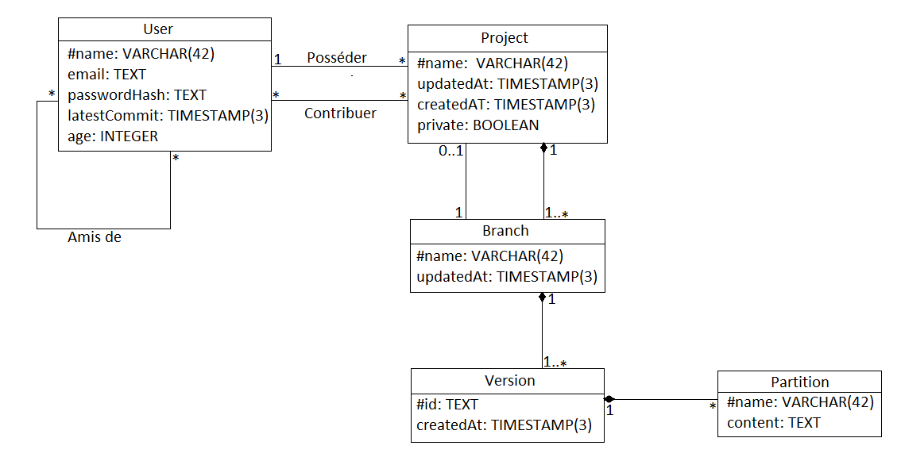

# Muse Git

## Cahier des charges

| Fonctions                   | Critère                       | Solution technique                             | Flexibilité | Niveau  |
| --------------------------- | ----------------------------- | ---------------------------------------------- | ----------- | ------- |
| Permettre de s'authentifier | Authentification forte        | Hash de mot de passe (Très sécurisé)           | 0           | SHA-256 |
|                             | Nom d'utilisateur             | Stocké en clair                                | 0           | N-A     |
| Administration              | Gérer les utilisateurs        | Utilisateur administrateur (bypass des droits) | 1           | N-A     |
|                             | Gérer les projets             | Utilisateur administrateur (bypass des droits) | 1           | N-A     |
|                             | Consulter projet comme userx  | Utilisateur administrateur (bypass des droits) | 1           | N-A     |
| Modification de profil      | Rejoindre un groupe           | Utilisation de php                             | 0           | PHP 7.1 |
|                             | Créer un groupe               | Utilisation de php                             | 0           | PHP 7.1 |
|                             | Quitter un groupe             | Utilisation de php                             | 0           | PHP 7.1 |
|                             | Modifier ses infos (age,etc)  | Utilisation de php                             | 0           | PHP 7.1 |
|                             | Gérer ses projets             | Utilisation de php                             | 0           | PHP 7.1 |
|                             | Gérer ses amis                | Utilisation de php                             | 0           | PHP 7.1 |
| Stocker les partitions      | Mise en ligne de fichiers     | Upload via html                                | 0           | https   |
|                             | Stockage des fichiers         | Conserver dans la base de données              | 0           | PGSQL   |
|                             | Téléchargement en local       | Download via html                              | 2           | https   |
|                             | Gestion des conflits          | Verification lors d'un merge                   | 2           | diff    |
| Consulter une partition     | Visualiser dans le navigateur | XML avec style                                 | 3           | N-A     |
|                             | Lister les participants       | Affichage en html/Javascript                   | 0           | N-A     |
|                             | Comparaison des partitions    | Affichage gauche/droite avec différences       | 3           | N-A     |
|                             | Zoom sur une partie           | Affichage en html/javascript                   | 3           | N-A     |
|                             | Jouer avec instruments online | Utilisation de bibliothèques                   | 5           | N-A     |
| Accès en invité             | Consulter liste utilisateurs  | Utilisation de PHP                             | 0           | PHP 7.1 |
|                             | Consulter liste projets       | Utilisation de php                             | 0           | PHP 7.1 |

## Fonction attendues:

- Liste de tous les utilisateurs 
- Liste de tous les projets stockés sur le serveur
- Login avec nom d'utilisateur et mot de passe
- Compte admin (visualisation comme user_k, suppression de projets sans sommation)
- Profil utilisateur éditable : Gérer son groupe/rejoindre/quitter, changer son âge, manage ses projets, manage ses amis
- Upload de partitions
- Téléchargement de partitions
- Visualisation de partitions dans le navigateur
- Comparaison de deux partitions (à gauche, l'ancienne, à droite la nouvelle avec en rouge les notes différentes)
- Possibilité de "zoomer" sur un groupement de 2-3 mesures en particulier, y compris pour les diffs
~ Stockage du diff ou bien de la partition ?
- Possibilité de gérer un conflit quand on merge
- Possibilité de jouer la musique avec des instrus synthétisés 

## Uses cases

## Diagramme E/R

